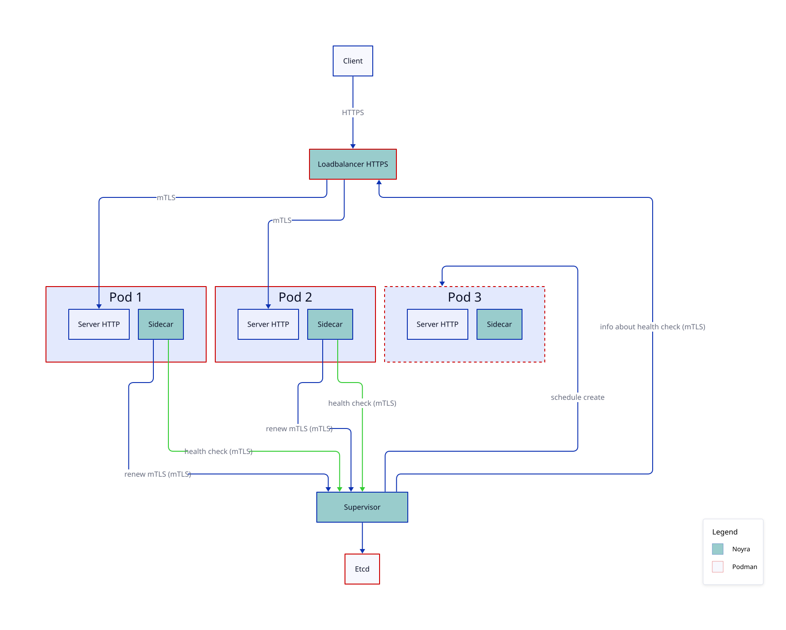

Noyra - orchestrator/scheduler for Podman
=========================================

L'idée de Noyra est née d'un constat simple : Il n'existe pas d'orchestrateur multi-nœuds léger pensé pour Podman et le rootless. Kubernetes, même allégé (k3s, k0s), reste disproportionné pour quelques nœuds.

Docker Swarm
------------
- **Root obligatoire**  
    le mode Swarm ne fonctionne pas en rootless, ce qui élargit la surface d'attaque
- **Daemon fragile**  
    toute l'orchestration repose sur le daemon Docker, et `live-restore` est incompatible avec Swarm : un redémarrage du daemon impacte les workloads
- **Couplage à iptables**  
    le réseau Swarm dépend d'iptables ; le support nftables de Docker, encore expérimental, exclut justement le mode Swarm

HashiCorp Nomad
---------------
- **Licence et modèle fermé**  
    plus open source depuis le passage en BSL (2023) ; certaines fonctions de production (audit logs, quotas) restent réservées à l'Enterprise
- **Complexité réelle**  
    autonome pour les cas simples, mais les besoins avancés (service mesh, secrets dynamiques) imposent vite d'opérer Consul et Vault en plus
- **Sécurité permissive par défaut**  
    ACL et mTLS désactivés out-of-the-box, à durcir manuellement

État actuel du projet
---------------------
Rien n'est fonctionnel, c'est le tout début du projet.  
Ce projet est public au cas où vous voudriez voir mes tribulations dans ce projet.

Au début je voulais gérer le fait que Noyra puisse gérer plusieurs serveurs physiques.  
Cependant afin de rester KISS et travailler correctement, je vais déjà me focaliser sur le fait que Noyra fonctionne correctement sur un serveur physique.
