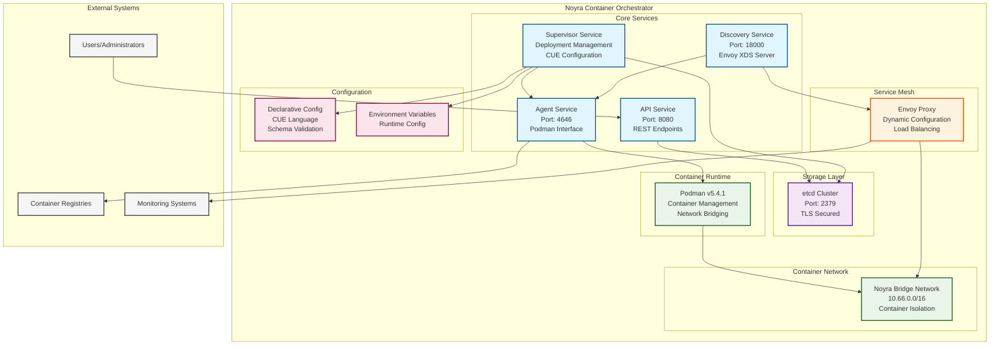
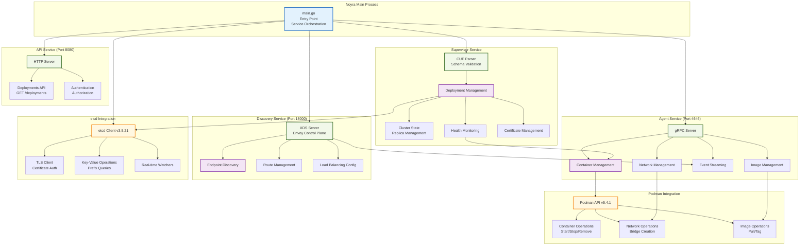
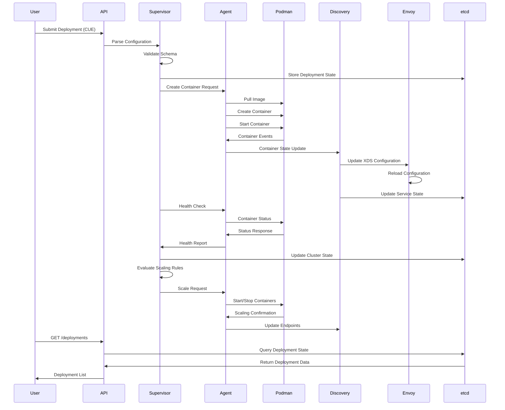
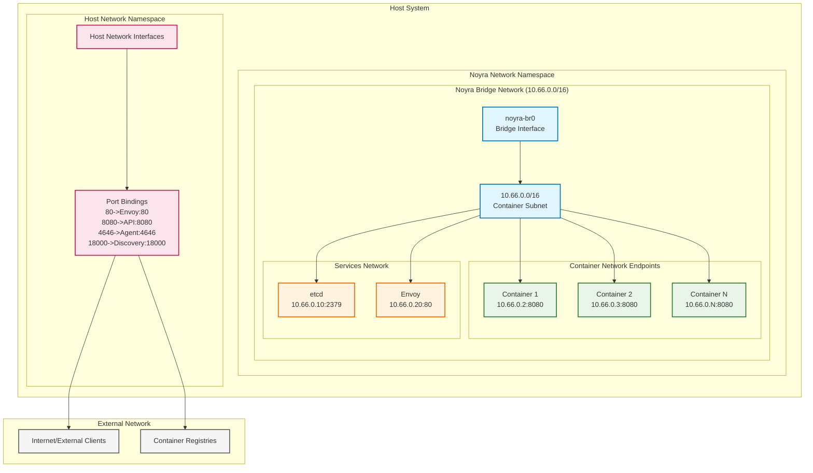
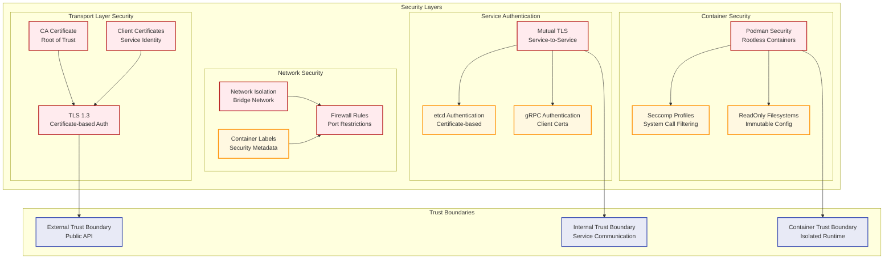
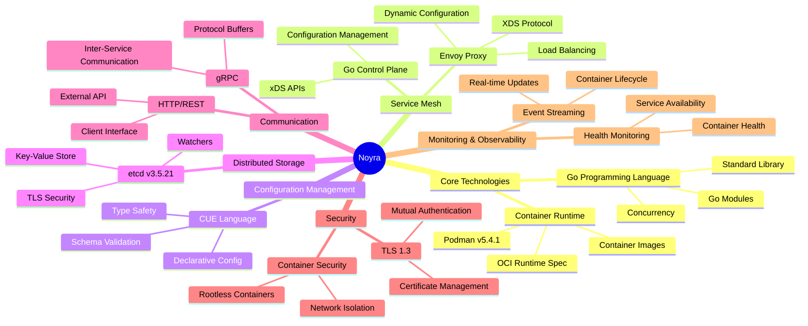
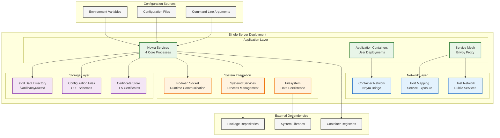

# Noyra Architecture Diagram

## High-Level System Architecture

## Detailed Component Architecture

## Data Flow Architecture

## Network Architecture

## Security Architecture

## Technology Stack

## Deployment Model

---

## Summary

Noyra is a sophisticated container orchestrator that provides:

1. **Lightweight Alternative**: Simplified Kubernetes-like functionality for single-server deployments
2. **Modern Architecture**: Microservice-based design with clear separation of concerns
3. **Service Mesh Integration**: Built-in Envoy proxy for advanced load balancing and service discovery
4. **Declarative Configuration**: CUE language for type-safe, validated configurations
5. **Production Ready**: TLS security, health monitoring, and persistent state management

The architecture follows cloud-native principles while remaining simple enough for single-server deployments, making it ideal for edge computing, development environments, or small-scale production workloads.